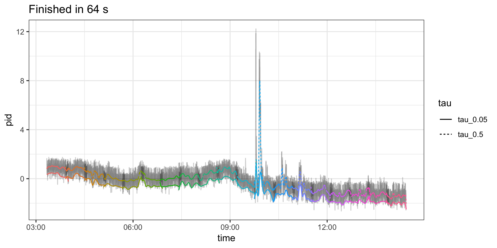
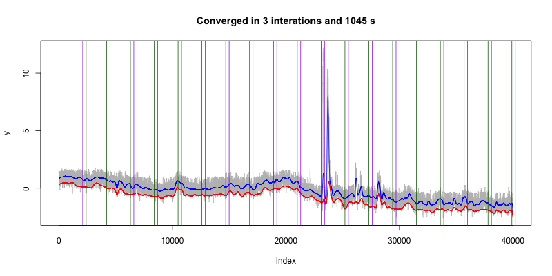

## Consensus ADMM algorithm
minimize $\sum f_i(x_i)$
subject to $x_i - z = 0$ 

$x_i^{k+1} = \arg\min_{x_i}\left(f_i(x_i) + w_i^{kT}(x_i - \bar{x}^k) + \frac{\rho}{2}||x_i - \bar{x}^k||_2^2\right)$

$w_i^{k+1} = w_i^k + \rho(x_i^{k+1}-\bar{x}^{k+1})$

Use $f_i(\theta_i) = \rho_\tau(y_i-\theta_i) + ||D\theta_i||_1$ where $y_i$ is the window. 

Single window size 1000, quadratic program takes 1427 ms and linear program takes 621 ms. 

## Paper innovations

* Trend filtering - compared to smoothing splines, splines with fixed knots, splines with adaptive knots
* Quantile trend over time
* Cross validation for smoothing parameter
* Parallelizable algorithm for smooth across smaller windows
* Non-crossing quantiles for ensuring valid estimates
* Application to low cost air quality sensors

